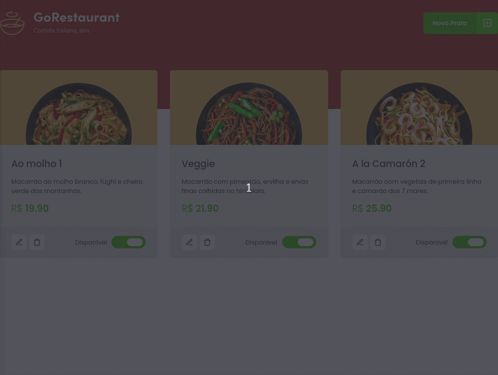

<h1 align="center">
    
</h1>

<h4 align="center">
  :curry: GoRestaurante ReactWeb
</h4>


<p align="center">


  

  
</p>

<p align="center">
  <a href="#rocket-technologies">Technologies</a>&nbsp;&nbsp;&nbsp;|&nbsp;&nbsp;&nbsp;
  <a href="#-project">Project</a>&nbsp;&nbsp;&nbsp;|&nbsp;&nbsp;&nbsp;
  <a href="#-Installation">Installation</a>&nbsp;&nbsp;&nbsp;|&nbsp;&nbsp;&nbsp;
</p>

<br>

<p align="center">
  
</p>

## :rocket: Technologies

This project was developed with the following technologies:

- [Json-Server](https://github.com/typicode/json-server)
- [React](https://reactjs.org)

## 💻 Project

GoStack Restaurant is a project developed during the [Rocketseat](https://rocketseat.com.br/)  GoStack as exercise to fix what was learned. It's a simple project that works like the panel of the restaurant itself where it is possible to control witch foods are for sale, available and what is to be added and removed.

## :electric_plug: Installation

1. Clone the repo
   ```sh
    git clone https://github.com/luanrem/GoStack-GoRestaurantWeb.git
   ```
2. Enter on the folder
  ```sh
    cd semanaomnistack11/<folder>/
   ```
3. Install YARN or NPM packages
   ```sh
   yarn
   // or
   npm install
   ```
4. Run the server
   ```sh
   npx json-server server.json -p 3333 -w
   ```
5. in another window Run the project
   ```sh
   yarn start
   // or
   npm start
   ```


<!-- MARKDOWN LINKS & IMAGES -->
<!-- https://www.markdownguide.org/basic-syntax/#reference-style-links -->
[contributors-shield]: https://img.shields.io/github/contributors/othneildrew/Best-README-Template.svg?style=for-the-badge
[contributors-url]: https://github.com/othneildrew/Best-README-Template/graphs/contributors
[forks-shield]: https://img.shields.io/github/forks/othneildrew/Best-README-Template.svg?style=for-the-badge
[forks-url]: https://github.com/othneildrew/Best-README-Template/network/members
[stars-shield]: https://img.shields.io/github/stars/othneildrew/Best-README-Template.svg?style=for-the-badge
[stars-url]: https://github.com/othneildrew/Best-README-Template/stargazers
[issues-shield]: https://img.shields.io/github/issues/othneildrew/Best-README-Template.svg?style=for-the-badge
[issues-url]: https://github.com/othneildrew/Best-README-Template/issues
[license-shield]: https://img.shields.io/github/license/othneildrew/Best-README-Template.svg?style=for-the-badge
[license-url]: https://github.com/othneildrew/Best-README-Template/blob/master/LICENSE.txt
[linkedin-shield]: https://img.shields.io/badge/-LinkedIn-black.svg?style=for-the-badge&logo=linkedin&colorB=555
[linkedin-url]: https://linkedin.com/in/othneildrew
[product-screenshot]: images/screenshot.png
